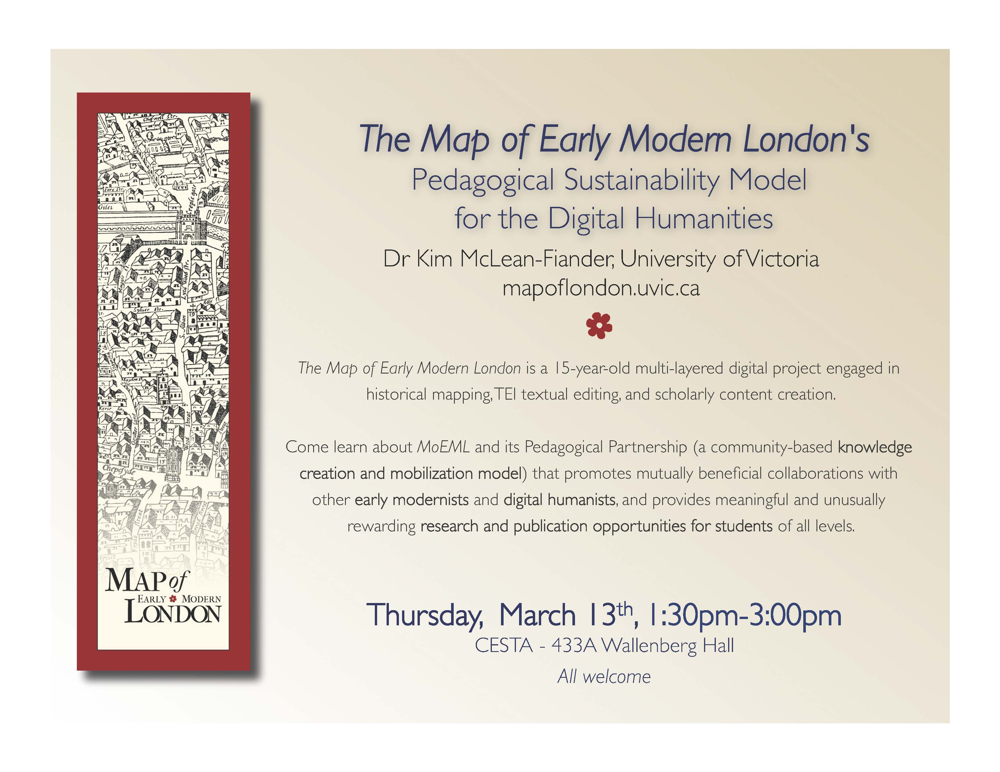

Date/Time: Thursday, 13 March 2014 - 1:30pm to 3:00pmLocation: 433A Wallenberg Hall - CESTA

[The Map of Early Modern London](http://mapoflondon.uvic.ca) (mapoflondon.uvic.ca) is a 15-year-old multi-layered digital project engaged in historical mapping, TEI textual editing, and scholarly content creation.

Some of its ongoing concerns include:

* how is editing a map the same as editing a text?
* what is the best way to encode fuzzy historical data?
* how do digital projects systematically generate content without compromising on
* quantity or scholarly quality?
* how do we ensure our projects have a life after the funding runs out?
* how can our research inform our pedagogy and vice versa?

This talk by MoEML’s Research Fellow and Assistant Project Director, Kim McLean-Fiander, is designed for librarians, English and History professors, digital humanists, and students. It will examine the community-based knowledge creation and mobilization model, or Pedagogical Partnership, developed by MoEML to ensure its own growth and sustainability. This partnership promotes mutually beneficial collaborations with other early modernists and digital humanists, and provides meaningful and unusually rewarding research and publication opportunities for students of all levels. Please join us March 13th, at 1:30pm in 433A Wallenberg Hall - CESTA.

