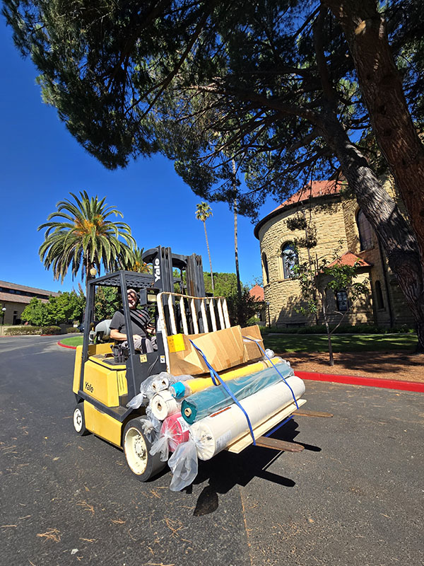
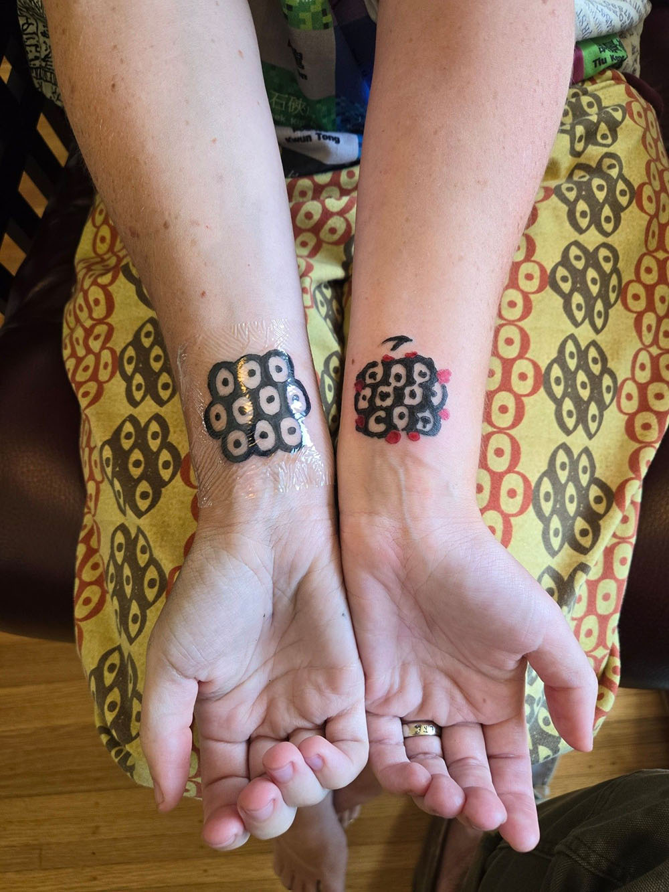
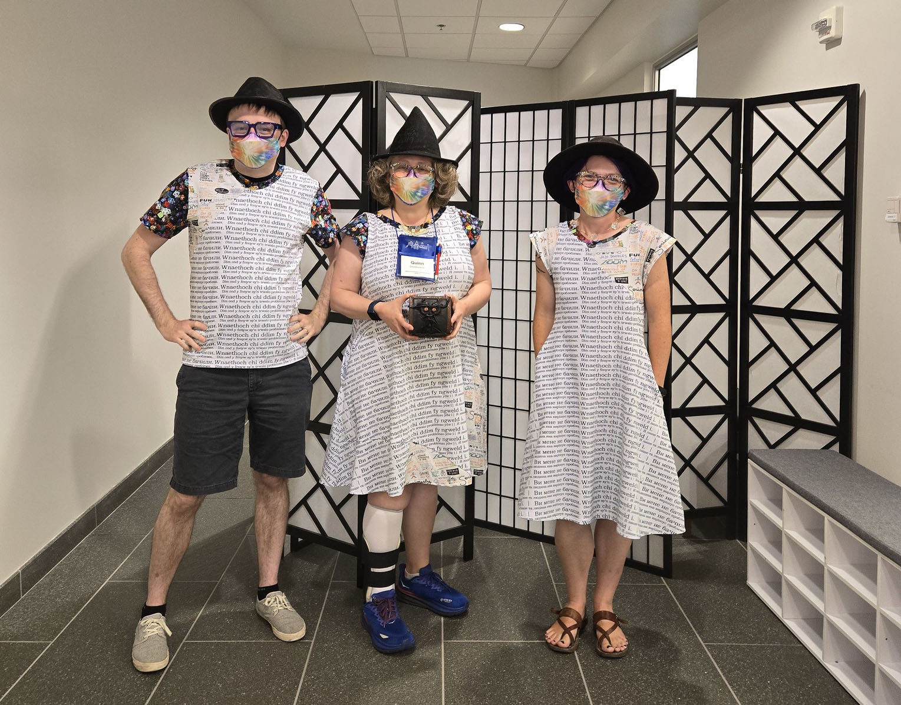

The summer was a relatively quiet period, and a much-needed break after the spring. 

## Textile Makerspace

Thanks to Jordan Minion and Kelsey Chen, we were able to hold open hours at the Textile Makerspace for much of the summer, including partnering with Stanford Summer Sessions to help fund student staff hours as part of their programming.

The Textile Makerspace hosted a crochet workshop for folks from the Mills Legal Clinic, organized with Candice Adams. It was a vindicating moment for the circular knitting machine, which I brought out for the one participant who was struggling after insisting they weren't a crafty person. Cranking a handle was totally doable, though, and they were the only participant who walked away with a finished scarf.

We received a donation of canvas and zipper stock from Craig Milroy, a [Making@Stanford](https://making.stanford.edu/) colleague in the [Product Realization Lab](https://productrealization.stanford.edu/). In the process, I learned that a forklift can squeeze through the bike lane and avoid the Duena St. gate.

I've got plans coming together with Anna Jerve (also from Stanford Libraries and Doerr School) to pilot a "fleece to fiber" spinning club this fall. We've identified a real interest that spans students and staff, and I can see points of intersection with the developing Environmental Humanities program in DLCL as well.

There's been an outpouring of interest in the joint textile specialist program with the Makery, and we'll have to make some hard choices about staffing for this upcoming year. But I'm excited about the potential of this collaborative stsaffing model.

## Classes

For this upcoming year, I'm teaching a compressed version of the non-English DH class in the fall, taking the winter off, then textile data visualization in the spring. I've been giving some thought this summer to what it might look like to teach a more coding-oriented version of non-English DH using generative AI plugins, but we'll see what the students' needs and interests (and langauges) are.

I'll also be running something we're calling the [DH Co-Op](https://dhcoop.stanford.edu/) throughout the year, focused mutual support for people who do non-English DH projects. I've built a very simple starter website, and have been mulling over different workshop and activity options for the group.

## Existing projects

As the summer wrapped up, I finished the next piece for **The Data-Sitters Club**, [DSC #21: Quinn and the Trouble with Environments](https://datasittersclub.github.io/site/dsc21.html). We've also got *DSC Super Special 1: Data-Sitters Debate at Dartmouth* almost ready to go, along with a new sub-series for beginners.

The **Senegalese Countercultural Movements** project, **Global Medieval Sourcebook**, **Multilingual Harry Potter fanfic**, and **letters to Christine Blasey Ford** projects have been on hold over the summer, and **The Futurist Archive** and **Flamenco letras** have been progressing on their own.

I revisited the **DLCL alumni data** this summer to create handouts for fall visits to potential grad program applicants, and got to beta test them as part of new student orientation. Progress has been slow on revisiting the **DLCL dissertations** but I've had some better ideas recently for how to process that data than last time I worked on it.

Off and on through the summer, I've been working with Eitan Kensky and Kristen Vallenti on the **Jewish cookbooks** project. It's been a lot of fun to think through different "data questions" that could be answered by a data set of ~70,000 recipes from assorted Jewish community cookbooks. We're in the process of getting the exhibit together right now, and I'm hard at work at crunching all the data to see what answers turn up.

**[SILICON](https://silicon.stanford.edu/)** continues to be a source of joy in my list of work projects. Audrey Gao has done an amazing job wrangling a [team of summer interns](https://silicon.stanford.edu/2024-silicon-unicode-interns/), planning for the *Face/Interface* conference in 2025 is well underway, and I've become the primary note-taker for the monthly meetings of the Script Encoding Working Group (SEW). Because I needed a new symbol gesturing to my beginnings as a Slavic medievalist, I got tattoos this summer of my favorite problem-child Unicode character, [Cyrillic multi-ocular o](https://en.wikipedia.org/wiki/Cyrillic_O_variants#Multiocular_O), in its original form and in its Unicode character representation. It's manuscripts, it's whimsy, it's reality vs. data, it's Unicode, and it captures a lot of the things I love about my work.

We haven't yet had the debrief meeting after the first year of the **Browsertrix Cloud pilot** but I'mo hopeful we'll be able to continue subscribing to the tool as sa resource particularly for archiving complex digital humanities sites before they begin to decay.

There's been ongoing interest in **Transkribus** throughout the summer, both for library-internal things (e.g. better accessibility for special collections materials) and for faculty projects (e.g. Alice Staveley's work on Virginia Woolf and Hogarth Press.) There's no shortage of AI-powered handwritten text recognition tools available now, but I really appreciate what Transkribus is doing to create a very low-barrier-to-entry, accessible tool for even non-technical scholars to do this work on their own, using models trained on data you can feel good about. I think Transkribus, and HTR workflows in general, have a lot of potential as a pragmatic use of AI in libraries, actually driven by user needs.

I didn't get very far on the list of **website accessibility** issues across various sites; I suspect that may end up being a winter project. 

Over the summer, Richard Tsai (president of the Taiwanese Association for DH) visited Stanford and gave a talk on his work developing a Mandarin-language LLM specifically for use in Taiwan. It was inspiring to see what people can accomplish when training models to level the playing field for specific linguistic cultural contexts. There was some ad-hoc discussion related to the **ACH AI working group** at the DH conference this summer, and we have an upcoming meeting and a panel slot at the virtual ACH conference in November. Also at the DH conference, I wrapped up my responsibilities as secretary of the **ADHO Constituent Organization Board**, 

At the beginning of this month, Roopika Risam and I passed the **ACH presidency** torch to Lauren Tilton and Andy Janco. It's one of the first times I've ever been able to hand something big over to someone else. It was strange but very satisfying writing "presidential transition" emails that spelled out what I had gotten done, what I hadn't managed to finish, and where various initiatives were. While I'm no longer the voting representative of ACH on the **ADHO Constituent Organization Board**, I'm still serving as secretary through the DH conference this summer. I think this marks the first time I'm not formally involved in running any DH professional organizations since 2014.

## New projects

There was enough to do on my existing projects, plus writing obligations I'd signed myself up for, that I actually managed to not start any new projects this summer!

I did get to spend a day at the D-School's new print shop as it was in development, though, and had a wonderful time learning about how their printing press works and trying out various donated plates, including some from Stanford Libraries (as well as the East Asian library, under its older Chinese name), many from the Hoover Institute, and lots of whimsical assorted things.

## Writing

This summer, the Data-Sitters Club finished editing our piece for the Journal of Electronic Publishing. Also with the Journal of Electronic Publishing, this summer an article came out on the history and future of multilingual publishing, with a focus on the early computing years and transition to Unicode. "[Encoding Multilingualism: Technical Affordances of Multilingual Publication from Manuscripts to Unicode and OpenType](https://journals.publishing.umich.edu/jep/article/id/5528/)", with Manish Goregaokar, Ben Joeng (Yang), and Abeera Kamran, ended up being a pared down version of a truly wild rabbit hole I went down early in the year, that initially included brief histories of the tyewriter and printing press across several scripts. As far as I know, it may also be the first publication that's used materials from Stanford's Unicode Collection of materials, the first collection I was involved in acquiring.

"Voices from the Server Room: Humanists in HPC", a collaboratively-authored piece with many DH folks who do/did DH support for HPC and the potential of that role as a career path for humanists, came out as part of *[Computational Humanities](https://www.upress.umn.edu/9781517915988/computational-humanities/)*, ed. Jessica Marie Johnson, David Mimno, and Lauren Tilton. 

I wrote a about the Textile Makerspace and the Data Vsiualization with Textiles class as a "statement of practice" piece for the *Journal of Modern Craft*.

And, despite several delays (that I joked were just me honoring the theme of the edited volume), I managed to write a piece entitled "Stop Lying to Yourself: Collective Delusion and Digital Humanities Grant Funding" for the volume *Reframing Failure*, ed. Michael Donnae and Anna-Maria Sichani.

## Talks and events

DH 2024 was busy, between my remaining duties as ADHO secretary and the four things I'd gotten accepted to the conference: a poster for SILICON, a workshop on teaching machine learning in the humanities, a #DHMakes mini-conference, and a one-shot campaign of the [#DHRPG](https://dhrpg.github.io/) I created for my project managemenet class. Unfortunately, everything but the poster ended up double-booked with ADHO secretary responsibilities, so I recorded a video about my [Future Text](https://github.com/quinnanya/future-text) class from last year, scared up some friends/dopplegangers to run the #DHRPG (huge thanks to Paige Morgan and Brandon Walsh for that), and dropped into #DHMakes during the break (and wove a shawl in solidarity while taking notes for ADHO).

