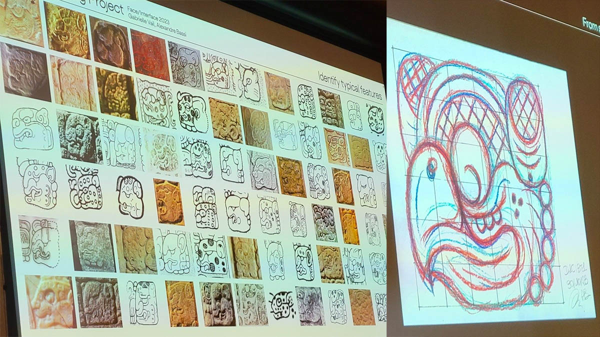
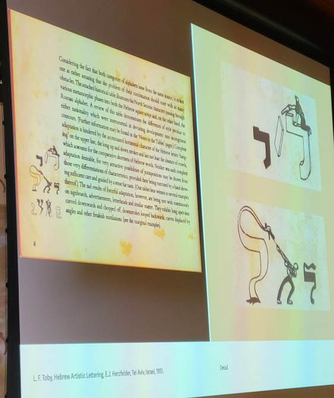

Fonts, like fountain pens, are a locus of intense, niche geekery — one I've only ever dabbled in, but where I can imagine my life being different very if I stumbled into digital typography at the right moment. Likewise with script encoding: when I learned about Debbie Anderson's [Script Encoding Initiative](https://scriptencodinginitiative.github.io/) while working at Berkeley, it made me wish I could go back in time and become and undergrad volunteer. The new [SILICON](https://silicon.stanford.edu/) (Stanford Initiative on Language Inclusion and Conservation in Old and New Media) project I've been working on with Kathryn Starkey, Tom Mullaney, and Elaine Treharne has been a source of great joy lately. It feels like a second chance to dive into some of these latent niche passions. The _Face/Interface_ conference at the start of December, organized by Tom Mullaney, served as the official kick-off for SILICON. It was a wonderful celebration of language, script, interface, and design, 40 years after a conference on "The Computer and the Hand in Type Design", held shortly after the founding of [Stanford's short-lived digital typography program](https://doi.org/10.1016/j.sheji.2020.08.006).

The program, as described in the opening and closing keynote by co-founder Chuck Bigelow, was a collaboration between the Art and Computer Science departments. In the end, it was the Art department's decision to withdraw from the arrangement that led to the program's demise after less than a decade. But during those years, Bigelow's mathematician collaborator Donald Knuth refined MetaFont (a vector-based type design description language) and developed TeX, which underpins and handles the layout for LaTeX. Donald Knuth was at the event as well. I'll confess I knew him better for his "literate computing" programming paradigm, which I'd referenced in my [Programming Historian tutorial on Jupyter notebooks](https://programminghistorian.org/en/lessons/jupyter-notebooks#literate-computing) and whose concept of "tangled" code executed by a computer and "woven" formatted documentation speaks to me even more now that I regularly untangle and weave things physically. And the students of the program went on to be key players in the ongoing development of digital typography in Silicon Valley and beyond.

I had decided in advance that I wasn't going to do a detailed livepost of the conference, especially since all the talks were being recorded. But there were so many remarkable moments that I did end up posting a few of them on Bluesky. Ariq Syauqi's talk on his work developing fonts for Javanese and Balinese raised fascinating, messy challenges like how you handle a concept like "bolding a word" when the script is a syllabary, where a syllable can be split between two words? The way that these scripts — which can involve no small amount of vertical stacking — get cut off and otherwise mangled in text-input fields of web forms was also thought-provoking.

Arshia Sobhan Sarbandi's experiments with AI-generating Perso-Arabic script showed how badly Dall-e 3 fails on it, even though it's improved dramatically for Latin. What's worse, these pseudo-script images are likely to end up in future training data sets, making the situation worse rather than better. He drew a connection to the use of "Arabic" script in Orientalist European art, like the background of Jean-Léon Gérôme's "The Snake Charmer".

I'll confess that AR tech has never spoken to me much, but nonetheless, Niteesh Yadav's talk about typography in AR was striking. In short, it's bad, but it's bad because today's AR is based on game engines, which are stuck in the 90's with how they render text: lots of bitmaps, where the texture and fuzziness is visible when you get "close".

We got a fascinating peek into the process of font designers, including Fernando de Moraes Caro's numerous revisions of his font for Dives Akuru, an extinct script, trying to balance "rationalizing" and embracing the irregularities inherent in calligraphy. Alexandre Bassi amazed the audience with his assemblage of examples of the Mayan jaguar glyph, and a video showing step-by-step his sketch of that glyph for his font — fresh off his digital pen, as apparently he'd been sketching in the car on an outing to San Francisco the day before.

Shani Avni & Liron Lavi Turkenich's talk took the interplay between technology and script in a different direction, showing how easily-broken wood type led to a shortened default ascender for Hebrew: a change not everyone was happy about, but one which put it into better vertical alignment when typeset with Latin script..

Manish Goregaokar and Ben Joeng (Yang) demystified the Unicode script proposal process by acting out a scenario for a script "from a small island off the west coast of Europe", which had to spell out and explain features like capital letters, and justify why certain glyphs like c and g shouldn't be unified. It was a wonderful moment of flipping the English default on its head for a moment, and I plan to use that video clip in a future non-English DH class. The pair's introduction slides were multilingual and multi-scriptural, giving their names in a variety of languages and scripts and showing an IPA transcription. During the coffee break, we talked about how the registration form for the event in the future should include two name fields: one for your name as used in English, and another with your name in your preferred script/language, or just another that you like.

Hrant Papazian teaches font design at Cal State LA, noting that the school's motto "ranked #1 in the nation for upward mobility" has a dark side: you can only get that kind of mobility starting from the bottom. The examples he showed of his students' work were beautiful; they learn to make fonts for non-Latin scripts, including ones for languages they don't personally know. He acknowledged that the money is in fonts for the Latin script, but he described advocating for non-Latin scripts nonetheless, drawing from his own pride in the Armenian script. This led to one of the most heated moments of the conference in the Q&A, which turned into a debate between Papazian and an attendee of Basque heritage about the value of a language having a distinctive script, especially in light of the technical challenges involved in having a non-Latin script. In this discussion, Peter Bilak also noted, drawing from his work on fonts for indigenous languages, that "in the absence of geographic autonomy, graphic autonomy is meaningful."

Kourosh Beigpour's poetic reflection on the Farsi type of Los Angeles added another perspective on script and identity. He took us on a tour of shop signs, neon lights, and gravestones in the Persian-speaking (but also vibrantly multilingual and multi-scriptual) neighborhoods of Los Angeles, often in the same, plain typeface but it was what they had 50 years ago when a community had to reconstruct their identity in a new place. Having signs in Persian, even without aesthetic fonts, signals "an Iranian is living or working here"; as he put it, "We are carriers of language. A script is a reflection of culture and heritage."

The conference was live-streamed, and all the recordings will be available online in 2024, which I really appreciate as a way to make the event more accessible from the perspective of the talks themselves. But it was likewise a reminder of how few examples come to mind of virtual spaces that recreate the playfulness that comes out in informal moments in person at a conference. One of my fondest memories was playing a game of "what's the glyph drizzled onto the soup" with Chuck Bigelow and other folks at my table, including Abeera Kamran.

[SILICON](https://silicon.stanford.edu/) is hoping to have Face/Interface be an annual event — keep an eye out for a CFP next year, or consider joining us in person or online!
