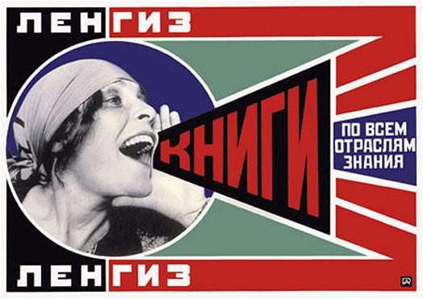The following is a slightly edited version of an invited paper I gave at the 2013 Annual Conference of the American Library Association in Chicago. A few of the audience members asked whether I might share or post the presentation, which I’m happy to do (as well as flattered… and very tardy). It’s obviously not meant as [another](http://nowviskie.org/2014/asking-for-it/) [response](/digital-humanities-curio-cabinet) to the recent [OCLC report on DH centers in libraries](http://www.oclc.org/research/publications/library/2014/oclcresearch-digital-humanities-center-2014-overview.html) (since it came earlier), but as I reread the talk, I see that, in some senses, it could serve as such.

It’s pretty long, so here’s the nutshell version: the digital humanities can and should make a happy home in the library, and this has been true for decades. What? – I hear some ask. – You mean to say that DH has been around for *decades*? Yes, – I say – and not only that, but DH has some very serious theoretical and practical forebears from almost a hundred years ago: the Russian Formalists, who even today have some important things to teach us not only about DH in general, but also about DH in the library. Oh, and (spoiler alert): Samuel L. Jackson (as Jules Winnfield) puts in a brief appearance as well.

---

The official description of [today’s panel](http://ala13.ala.org/node/10087), “Literary texts and the library in the digital age,” reads as follows:

Digital technologies are opening up new possibilities for the investigation of literary and historic texts. They are also changing library spaces and reconfiguring relationships between librarians and researchers. This program investigates new roles for European and American Studies librarians in this emerging physical and virtual environment.

I’m going to try a “slow burn” approach, and not reveal the actual title of my paper just yet.  Our panel today is called upon to discuss “literary texts and the library in the digital age.”  I suppose it's possible to imagine, based on this title, that the panel is not explicitly about the digital humanities; oddly enough, the widely accepted term of art “digital humanities” doesn’t appear in the panel description at all, although I’ve assumed that you’ve come to hear precisely about that, and that’s certainly what I’ve come prepared to talk about.

Does this reticence actually to name the topic come from a sort of DH fatigue? Or a DH phobia?[[1]](#_ftn1) 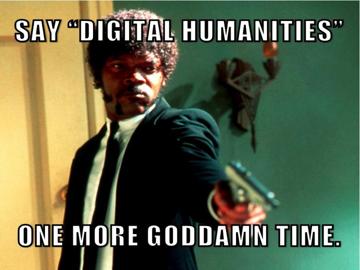

I sincerely hope that it’s neither fatigue nor phobia.  I certainly see in our panel description all the signs of contemporary digital humanities and digital library discourse: phrases like “digital technologies” and “opening up new possibilities”; loaded terms like “changing,” “reconfiguring,” “emerging,” and “virtual” speak to a current fascination with (or, some may say, even fetishization of) the affordances of technology as they apply to literature and the library.

But I also see other words in the panel description, and these in fact please me more: “investigation,” “literary,” “historic texts,” “relationships between librarians and researchers,” “European and American Studies.”  These are good, old-fashioned words about humanities research and “traditional” library work.  (Some recent reading, which I’ll mention in a bit, has made me wary of that “traditional” concept, though.)

As I’ve thought about what I might present to an audience of librarians, I decided to go for something that had at least a chance of being new to you – something you may not have thought about, or read from the dozens of truly outstanding writers about the topic of digital humanities in the library.  I’m thinking especially of two very recent edited collections of articles that I recommend especially highly: the first is a special digital humanities-focused issue of the *Journal of Library Administration*, v. 53 no. 1 (of January 2013), guest-edited by Barbara Rockenbach, and with contributions by many of my favorite practitioners and thinkers in the digital humanities and library fields: Bethany Nowviskie, Miriam Posner, Jennifer Vinopal, Monica McCormick, and many others. This special issue is available ([behind a paywall](http://www.tandfonline.com/toc/wjla20/53/1)) from its publisher; [open access preprints of its individual articles](http://micahvandegrift.wordpress.com/2013/01/30/proof/) were helpfully gathered by one of their authors, Micah Vandegrift.

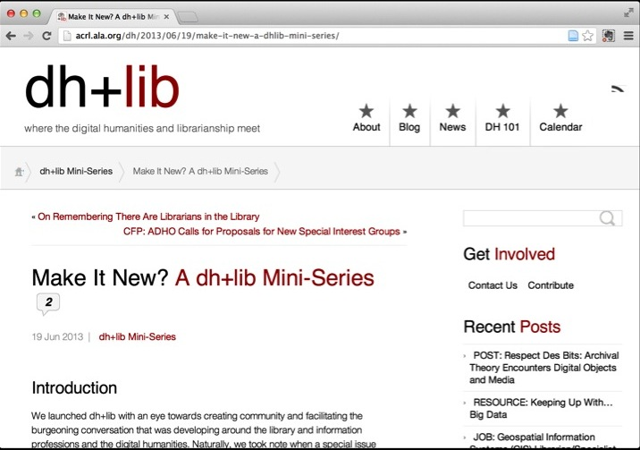The other collection, *Make It New?*, is a set of responses to that same journal issue, edited by Sarah Potvin, Roxanne Shirazi, and Zach Coble, in the outstanding new [dh+lib](http://acrl.ala.org/dh/) group blog, sponsored by Associaton of College & Researcy Libraries.  This collection was originally published as a [mini-series of blog posts](http://acrl.ala.org/dh/2013/06/19/make-it-new-a-dhlib-mini-series/), and was later compiled, together with the original *JLA* articles that inspired it, into a [very slick ebook](http://acrl.ala.org/dh/2013/06/28/make-it-new-a-dhlib-mini-series-the-ebook/).

I can’t recommend these readings, or the thoughtful group of library workers who contributed to both of them, highly enough: for me, the highlight of the dh+lib collection is Trevor Muñoz’s piece on , which he rightly calls a “provocation.”  I don’t want to name too many more names, lest I leave somebody out – but the contributors to both of these collections, and to the dh+lib blog in general, are people you should pay attention to if you’re interested in the challenges and rewards of doing (or supporting, or “making”) DH in your library.

In the introduction to the dh+lib mini-series, Potvin and Shirazi put forward an interesting set of binaries, remarkably reminiscent of the description of today’s panel:

“DH as entrepreneurial v. DH as institutional enterprise, DH as disruptive v. DH as contiguous, libraries and librarians as partners or supporters, collaborators or service-providers. What is new, what is traditional, what is novel, what is constant.”  (Sarah Potvin and Roxanne Shirazi, [Introduction to “Make It New? A dh+lib Mini-Series”](http://acrl.ala.org/dh/2013/06/19/make-it-new-a-dhlib-mini-series/))

You may already guess where my preferences fall in most of these binaries; if not, I hope those preferences will be clear by the end of my talk.  But I’m not going to talk about these questions, at least not directly.  I don’t plan to repeat what these many colleagues have written – and written very thoughtfully and well, in a multitude of texts that you all can read yourselves.  Instead, I’ve decided to take full advantage of the “literary text” portion of our panel’s theme by talking about an aspect of the Digital Humanities that you may not have heard elsewhere, that you may not have considered before in your thinking about library and digital humanities work.

### How library DH is made

After these over-long preliminaries, here’s the real title of my talk: “How library DH is made.”  I intend it to be patently brash and purposefully provocative – and if it sounds a little strange, that’s because it’s meant to, for reasons that I hope will become clear in a few minutes.

My title, and the real inspiration for my talk, both come from an essay that’s nearly a hundred years old: “How Gogol’s ‘Overcoat’ is made,” by Boris Eikhenbaum, which itself was obviously inspired by a novella that’s seventy-five years older than that. 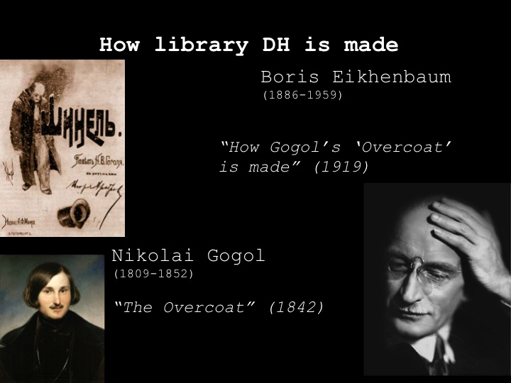

Like my title itself, this choice of inspiration – a century-old Russian Formalist essay about an even older comic novella – may appear to be far-fetched for a digital humanities paper at a library conference.  In fact, I hope it *also* sounds a little strange to you.  (Believe me, it’s far from the oddest metaphor I’ve relied on in similar situations.)  I’ll of course try to convince you that it’s a good inspiration, a good metaphor for what we do in the digital humanities.  But even if I don’t succeed, at the very least I will have reminded you of an outstanding short work of comic fiction, illuminated by an outstanding short piece of literary criticism, and I hope you’ll remember them next time you’re looking for something to read.  (All false modesty aside, it should go without saying that these two literary texts will surely give you more of lasting value than I ever could!)

Gogol’s 1842 story is about a poor, socially inept bureaucrat – a scrivener – named Akakii Akakievich (and yes, his name sounds just as much like “caca” in Russian as it does in English).  Akakii is ridiculed at the office because of his threadbare overcoat.  When his tailor tells him that the coat is finally beyond repair, Akakii becomes obsessed with obtaining a new one.

After working obsessively long hours, scrimping, and saving, his obsession finally pays off in the purchase of a newly tailored overcoat.  Overjoyed with his new possession, finally secure in the warm, maternal embrace of his new overcoat, he returns to work, where both he and his overcoat are celebrated by his co-workers – which of course only adds new levels of social anxiety.

That angst is greatly intensified when two ruffians steal the new overcoat from Akakii on his way home that very night.  His angst reaches its apotheosis when he appeals to the authorities – specifically to a general named only as “The Personage of Consequence” – and is spurned – berated, even – for having approached such an important person with such a trivial complaint.  Rejected, wracked with anxiety, naked (or at least overcoatless), Akakii takes ill and dies.

For some time after, the ghost of Akakii Akakievich haunts the St. Petersburg streets, stealing the overcoats of shivering pedestrians.  The ghost is pursued by the police, of course to no avail, but is finally put to rest when it manages to steal the overcoat of The Personage of Consequence himself.

It wouldn’t be hard to do an on-the-spot undergraduate interpretation of Gogol’s ghost story.  A symbolic reading of Akakii Akakievich’s expulsion from the furry, enveloping warmth of the overcoat into a cold, inhospitable world is one obvious tack.  Although it would of course be anachronistic to call this interpretation “Freudian” in the 19th century, Dostoevsky’s famous aphorism, “We all came out of Gogol’s overcoat,” points in precisely this direction, as he assigns the very birth of 19th-century Russian literature to the womb of Gogol’s “Overcoat.” 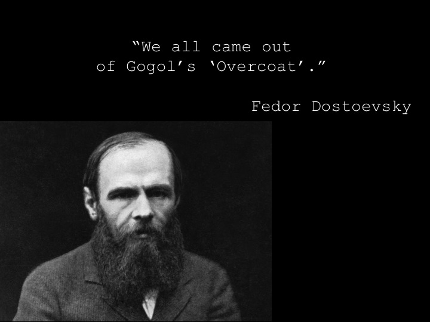

But most professional readers of the later 19th and early 20th centuries focused on the story as a social critique of poverty and alienation, on the dehumanization of bureaucracy, and so forth – focusing on the very few sentimental and pathos-filled lines bleated by Akakii Akakievich in the midst of his many deprivations.

Eikhenbaum utterly demolishes this reading in his 1919 essay, focusing instead on the highly stylized narrative voice in the story – for which he invented the term *skaz* (still in current use, even in non-Russian discourse) – with its orality, its grotesqueries, its parody, and embodied in Gogol’s incessant wordplay and “phonetic mimicry.  In fact, Eikhenbaum claims that this *skaz*, this narrative voice, is not even *narrative* so much as it is “gestural and declamatory” – that in fact *skaz* is the primary structural element of the narrative: Without skaz, he says, there is no story.

Eikhenbaum argues that Gogol’s “Overcoat” is made not of events, or plot, or characters; it is not some mystical embodiment of the author’s “soul” or “psyche.”  Rather, the “Overcoat” is made of the “personal tone of the author,” of *skaz*, of wordplay, of phonetic gestures, of performative mimicry, of linguistic linkages – in short, it is made of *language*, and nothing more.  As Derrida would proclaim 50 years later, “There is nothing outside the text.”

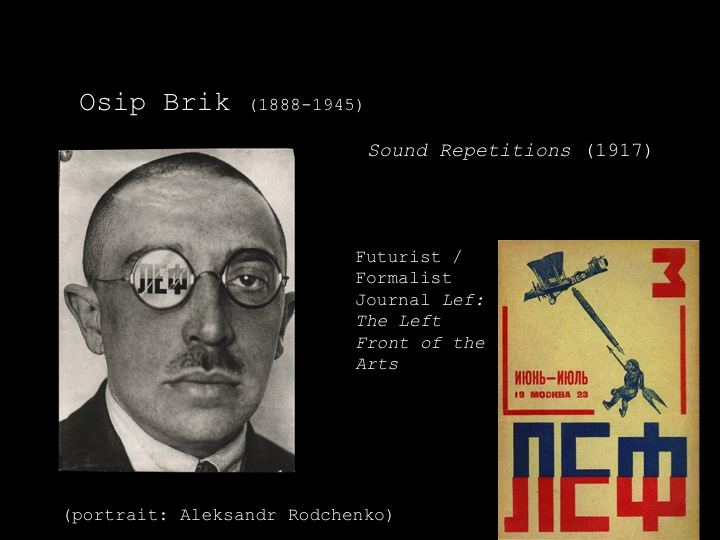

Eikhenbaum’s great essay is one of the foundational texts of what became known as Russian Formalism.  But of course there were other well-known Formalists expositing other Formalist ideas.  There was also Osip Brik, a poet and critic who focused even more tightly than Eikhenbaum on the stuff of literary language as he carried out quantitative studies of phonetics in poetry.

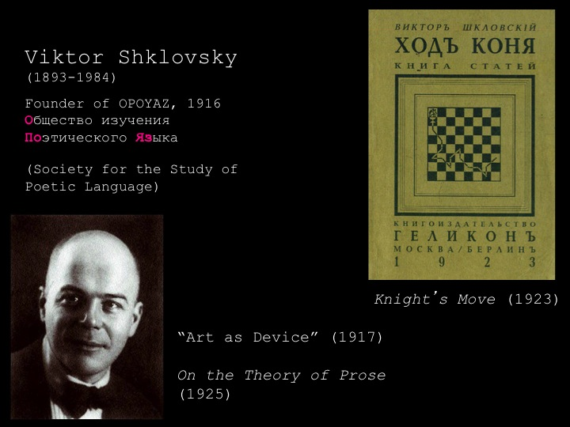

And there was Viktor Shklovsky, founder of the most important of the Formalist institutions, the Society for the Study of Poetic Language, who went further than Eikhenbaum in declaring that art is really just “device,” “artifice” – nothing more.  In this same 1919 essay, “Art as device,” Shklovsky proposed the idea of “defamiliarization,” or “ostranenie” – making the common appear strange in order to enhance our perception of it.  In one particularly pithy 1923 monograph, *Knight’s Move*, he took the extreme artificiality and non-linearity of the chess knight’s move as a symbol for the peripatetic and defamiliarizing ways devices are deployed as art.

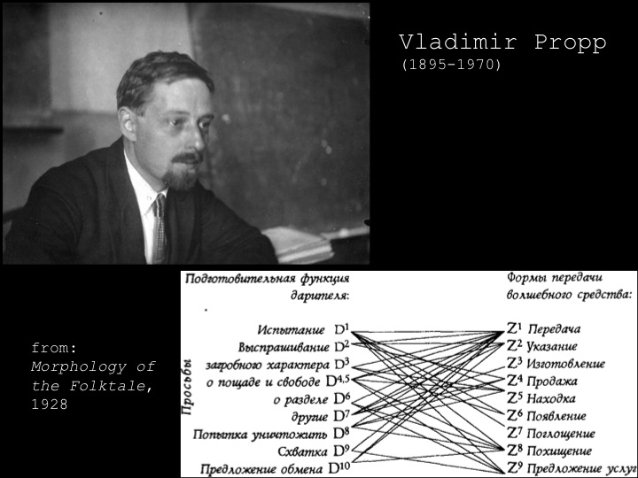

And there was Vladimir Propp, perhaps the best known of the Russian Formalists (at least in the contemporary West) for his 1928 *Morphology of the Folktale*, focusing on folk-literary systems and relations.   I’m especially fond of Propp’s style of network analysis and data visualization.

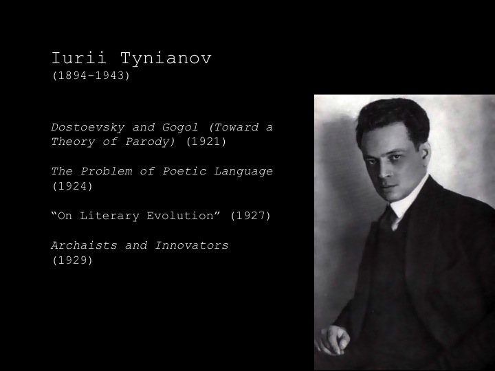And we have Iurii Tynianov, who wrote in his long 1927 essay “On Literary Evolution” that that what passed for the study of “literature” before the Formalists was actually only “the study of the *generals* of literature,” thus advocating for a much broader consideration of the vast sweeps of non-canonical.

---

Now is the time to fasten your seatbelts as we zoom from 1920s Leningrad to our day. Tynianov’s quip about the scholarly error of allowing only “the generals” to pass for all of literature is precisely the point of Franco Moretti, made anew for our times in in his own foundational essay “[Conjectures on World Literature](http://newleftreview.org/II/1/franco-moretti-conjectures-on-world-literature)” (*New Left Review*, Jan./Feb. 2000), which practically inaugurated the 21st-century DH practice of “distant reading” (Moretti coined that term here) of what he called “the great unread” in world literary history.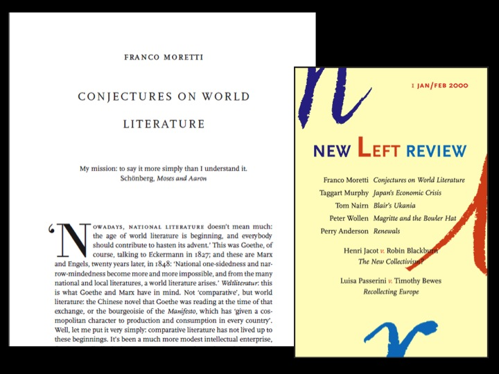

And when Matt Jockers, in his 2013 monograph *Macroanalysis*, produces massive network graphs representing his quantitative studies of literary history (such as we see on his book’s stunning dust jacket), his focus is precisely that of the Russian Formalists: namely, *form*, *system*, and *language*.   When he presents textual work as a data visualization, as so many contemporary digital humanists do, he is defamiliarizing those texts, making them strange, precisely as Shklovsky advised.

And when the productive and dedicated DH community of stylistics and authorship attribution scholars uses statistical packages to algorithmically cluster digital texts according to style and authorship, they’re just extending Eikhenbaum’s *skaz* onto a more quantitative and computational footing.

And when the [Stanford Literary Lab](http://litlab.stanford.edu/) produced its [first research pamphlet](http://litlab.stanford.edu/LiteraryLabPamphlet1.pdf) a few years ago, it was very clear to them what they were doing, and in whose footsteps they were following: their title was "Quantitative Formalism."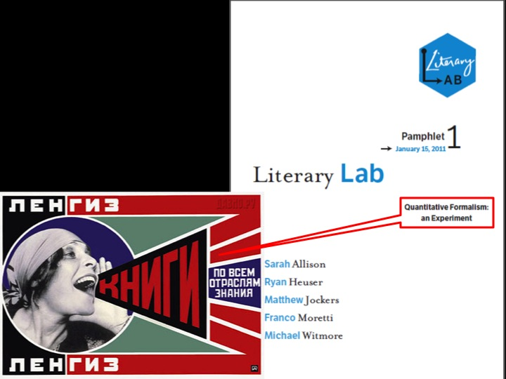

I’m here to proclaim that the digital humanities are a 21st-century version of Russian Formalism of a hundred years ago.   Just as Dostoevsky, Tolstoy, and Turgenev all came out of Gogol’s “Overcoat,” my claim is that we digital humanists – including us digital humanities librarians – in some sense have all come out of Eikhenbaum’s great essay, and out of the foundational writings, approaches, and ideas from Eikhenbaum’s fellow Formalists.

In approaching the literary text, we focus on “how it’s made” – how literary history, genre systems, narrative lines, character networks, and even language itself are “made.”  Like the Russian Formalists, we in the textual digital humanities focus on “The Word as Such” (to use the title of a manifesto by two poets who were close comrades to the Formalists, Aleksei Kruchenykh and Velimir Khlebnikov); the advantage we claim in a particular digital approach is that we can do that at scale: our focus can be telescopic.  But the object in view is very much the same as that of our predecessors.

And what does all this have to do with the library?  The library is where the Stanford Lit Lab gets the vast majority of its raw materials: the data that is its lifeblood; the same is true (or should be true) for countless cadres of digital humanists around the world, and for the libraries with which, and in which, we work.  Over the years, we librarians have selected it, procured it, curated it, preserved it, and made sure that our licenses are generous enough for us to use it.

The library is also, and always has been, a locus of long-term memory.  That core library value comes strongly into play for successful DH as well: more than just a passing fad, acknowledging and proclaiming that DH is here to stay (and has been for a long time already!), we in the library should make long-term, structural commitments to digital humanities work, rather than relying on short-term hires or crudely tacking on new job responsibilities to those of already-busy librarians.

Finally, one of the hallmarks of digital humanities practice has been the desire to experiment, to make things, to dig into our data – to see how humanities “things” are “made.”  There is nothing contrary to the library spirit in that desire either: in fact, librarians – perhaps even more than other knowledge workers – have long distinguished themselves with the very gears and cogs of literary production and study: with the book trade; with bibliography and metadata; with the acquisition, organizing, and preservation of textual objects; with a variety of technological means for scholarly discovery.  What is all this traditional library work if not an engagement with how knowledge is “made”?  And what are we, if not co-makers of that knowledge?

I realize that I haven’t provided many concrete ideas about how DH is done in the library.  But I do hope to have defamiliarized the practice of digital humanities (and of digital humanities librarianship) for you somewhat, made it somewhat strange, and challenged your notion of its depth and critical heritage.

---

[[1]](#_ftnref1) This “one more goddamn time…” image has been used by [Ted Underwood](http://tedunderwood.com/2012/09/22/how-everyone-gets-to-claim-they-do-dh/), and by the *Los Angeles Review of Books* in a polemic initiated by Stephen Marche late last year (“[Literature is not Data: Against Digital Humanities](http://lareviewofbooks.org/essay/literature-is-not-data-against-digital-humanities)”), among many others; I use it here as the product of folk imagination, without attribution.  (If it's yours, please tell the [University College London Centre for Digital Humanities](http://www.ucl.ac.uk/dh/), which includes it in a very nice collection of [DH memes](http://blogs.ucl.ac.uk/definingdh/digital-humanities-and-design/memes/).)  UPDATE: Ted Underwood informs me that "For the record, this super-successful contribution to DH critique was created by @frankridgway back in 2012."  Thanks, Ted - and Franklin Ridgway!

