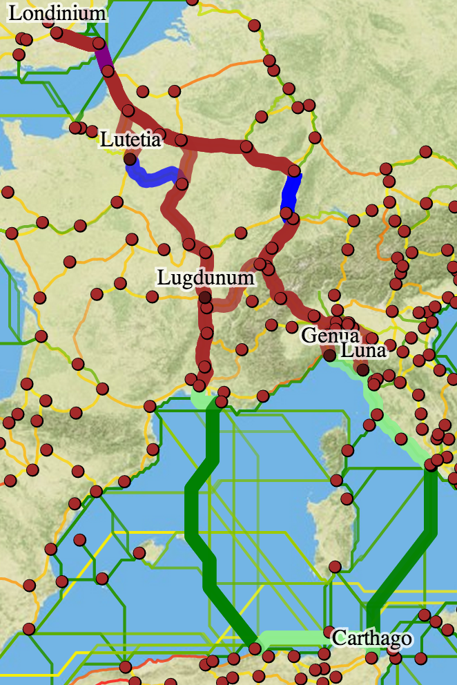
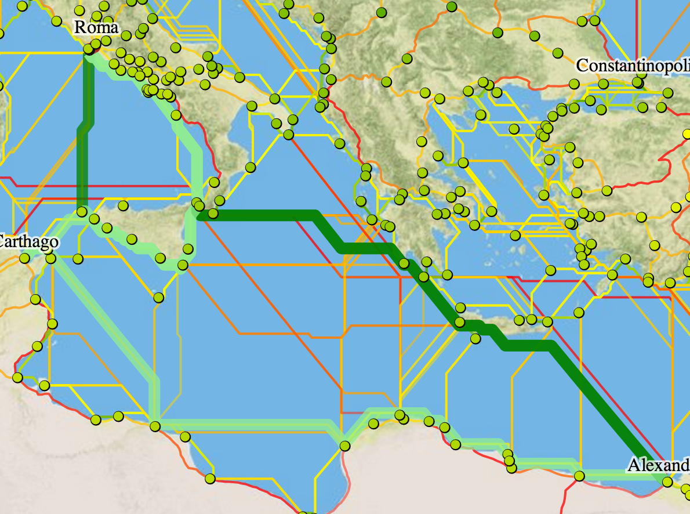
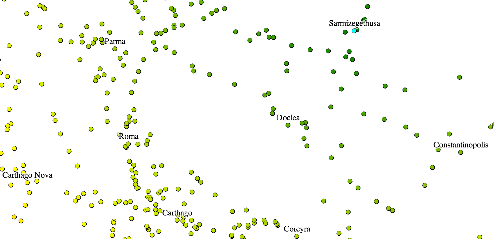
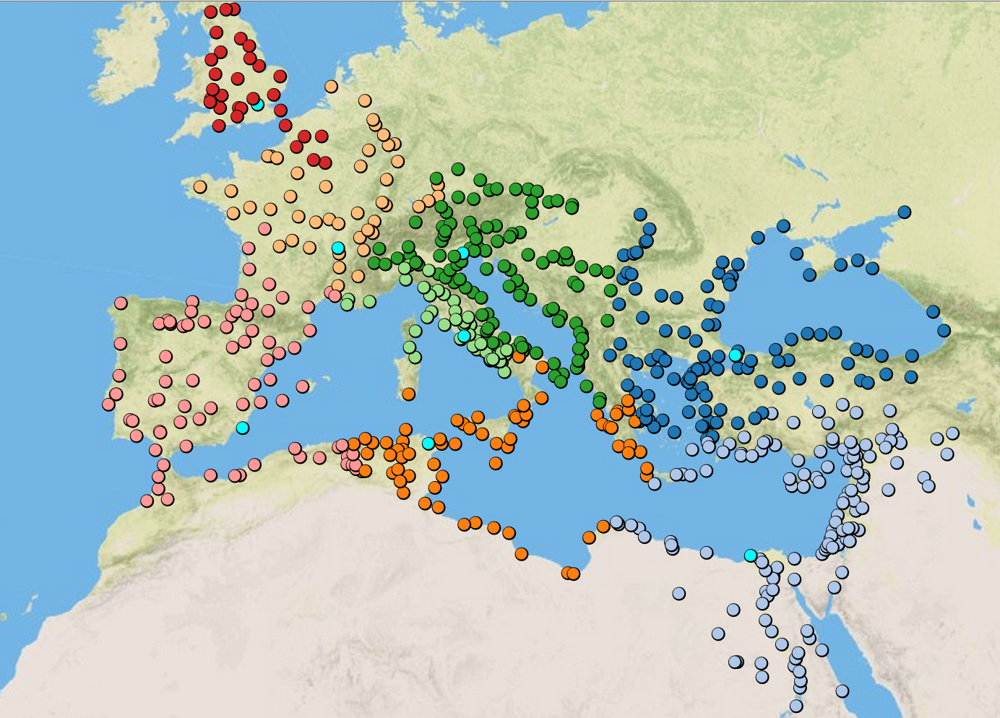

Over the coming months, I'll be spending some time integrating new features, data, and base layers to [ORBIS: The Stanford Geospatial Transportation Network of the Roman Empire](http://orbis.stanford.edu). While ORBIS was tremendously successful both in its [public appeal](http://orbis.stanford.edu/#media) and its [use in scholarship](http://orbis.stanford.edu/#news), there has been a growing list of small and not-so-small features that could improve the model or the user experience of it. Some of these have already been implemented in a prototype version seen in the screenshot above. Rather than wait for the new version to be finished, though, ORBIS v2 will be developed publicly, with the code available on Github. This way, ORBIS will benefit from the user feedback and feature requests of the larger digital humanities and software development community. There are still a few systems administration and database steps that need to occur before this can happen, but when the code and new site are available, the link will be posted here and on [@ORBIS\_Stanford](https://twitter.com/ORBIS_Stanford) on Twitter.

But it would be a shame to wait to talk about some of these new features, given that they've already been implemented and allow for fundamental changes in the way you can use ORBIS. A few are purely technical. The ORBIS v2 map is entirely built in [D3.js](http://d3js.org), using the stable but still-in-development [geo.tile](https://gist.github.com/mbostock/4132797) functionality to serve a [MapBox](http://www.mapbox.com) terrain map with a much higher resolution than the locally hosted Natural Earth tiles used in the current version of ORBIS. The additional geospatial capabilities of D3 allow this version of ORBIS to have an SVG layer of 1600 route segments that can be colored by speed, expense, or type (colored by type, above, so that you can see where ORBIS simulates overseas, coastal, river, and road connections) as well as clickable sites allow the user to turn on or off labels or perform other site functionality.

One such piece of site functionality is the ability to remove sites from the ORBIS network and see how the removal of that site changes the route from one place to another. Here you can see the route from Carthage to London, and how it changes with the removal first of Lutetia, then Lugdunum, then Genua and finally Luna. Along with the vehicle and mode constraints of the original ORBIS route-finding, the ability to remove sites can simulate more accurately particular scenarios.

Further variation to routes can occur as a result of the new transfer cost functionality. ORBIS v2 allows the user to set a transfer cost in days to switch from one mode of transport to another, so that any switch from road to coastal, coastal to overseas, overseas to river, or any variation thereof, will cost an additional amount of time. Here the route from Alexandria to Rome takes a direct route through the Straits of Messina with no transfer cost, continues up the western coast of the Italian peninsula with a 2 day transfer cost (thereby making it inefficient to take the "overseas" route from Messina to Portus) and foregoes any overseas travel at all with a grossly inflated 10 day transfer cost. The current development version of ORBIS v2 has a single generic transfer cost, but the final version will have a specific cost for each transfer to a certain type of travel, so that a user could set a 3 day cost to switch to overseas, a 5 day cost to switch to river, and a 1 day cost to switch to coastal.

All these new modifications to the routing function factor into the v2 cartogram, which is now integrated into the route-finding map (making it scrollable and zoomable) and capable of being run from any center with any settings. Here Sarmizegethusa is the center of the cartogram, with 5 day transfer costs and coastal routes disabled in February.

As with the original cartogram, the sites can be seen on the map colored by the cartogram settings. One exciting new feature that becomes available with the capacity to run these dynamic distance cartograms from any site in the ORBIS model is the use of clustering to show which sites are closest to each of these user-defined centers. This clustering can show not only regions within the Roman world around key sites, but also regions around a single site as defined by different transport modes or media.

The cartogram centers, shown in cyan, are surrounded by the sites closest to them, splitting the Roman world into distinct and, critically, user-defined areas. There are other features slated for v2 of ORBIS, as well as the integration of more detailed routes and route information, but hopefully those will be visible in the public development site and not in simple static screenshots like these.

