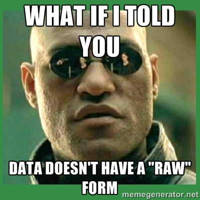

Like most valuable human experiences, this all started on Twitter, when I used a tired meme to deliver what I thought would be considered radical to folks not involved with information visualization but rather pat to those that were.

As an example, I tweeted along with it what I thought was uncontroversial, that "Even a spreadsheet is a form of information visualization." The point I was trying to make was that data doesn't exist in a "natural state" that you are trying to best visualize, but rather you process it even when you view data in tabular form, and that the processing transforms it from data into information because that processing of the data is embedded in the final product. I realize this is at odds with some epistemologies of data-information-knowledge, but I'm less interested in this from a theoretical standpoint as I am from a practical standpoint. I think, practically, that spreadsheets are information visualization. This was recently demonstrated by [Dark Horse Analytic's gif](http://darkhorseanalytics.com/blog/clear-off-the-table/) of how to make a spreadsheet more effective visually\*:

It is, fundamentally, a layout, much like the [various infoviz layouts found in D3](https://github.com/mbostock/d3/wiki/Gallery) and which I've been thinking about more lately as I write [D3.js in Action](http://www.manning.com/meeks/). By layout, I mean it's rules or a recipe that, when applied to a dataset, returns settings for graphical channels to improve comprehensibility. In the case of a spreadsheet, though, what graphical channels could possibly be available? More than you think, even when you acknowledge (as I do) that the above GIF is correct when it suggests you should leave color mostly out of spreadsheets. You may not notice it, but a spreadsheet has just as many axes as a bar chart or a scatterplot. How you sort a spreadsheet, like any other decision to present information, does not come "from the data" but is rather a decision. The order of columns and rows, especially in large spreadsheets, determines the view into the data. Likewise, font weight, text justification, formatting are all mechanisms for graphically processing data to represent it (either to an audience or to yourself for exploratory analysis). When you factor in the presentation mechanisms for aggregate statistics that takes place as part of the spreadsheet (summing or averaging row or column values) you end up with an information visualization space that's far more feature rich than your typical histogram.

There's another practical reason for which I think we should think of spreadsheets as information visualization: it demystifies the benefits of applying clear graphical rules to the display of information. Rules for better spreadsheets and better pie charts aren't about making them look hip, they're about making them more effective for communication. Too many people deride information visualization as superficial, and contend that when they examine a spreadsheet (or other form of "raw data") that they're not sullying themselves with this hipster field. If we acknowledge that spreadsheets are, like other infoviz, embedded with transformation of data to present it, then we validate other transformations for presentation, analysis and exploration.

Likewise, too many people deride overly complex information visualization under the assumption that all information visualization falls into the category popularized by Tufte: Summaries of complex phenomena for busy decision-makers. While this is a dominant category of infoviz, it is not the only one, and other categories include networks or maps that require the time and investment that a complex spreadsheet or tabular view of a database might.

Spreadsheets have been around for a long time, with apparent examples in cuneiform and from early Egypt. In comparison, the pie chart was invented a little over 200 years ago. So, it's no wonder we think of one as somehow closer to reality than the other. But that distinction is only valuable insofar as it is useful. I think we're better off, as information visualization matures and grows more common, re-evaluating the methods that we've grown so comfortable with as to think them to be "natural" or "raw" representations of data. Doing so is good for the spreadsheet, and good for the network visualization, and good for data literacy more generally.

\*It's not lost on me the irony that from Dark Horse Analytic's perspective that this is presented as [getting closer to "data" by removing visual cruft](http://darkhorseanalytics.com/blog/data-looks-better-naked/).

