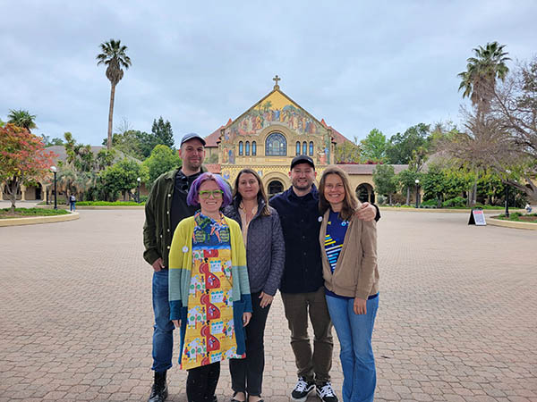
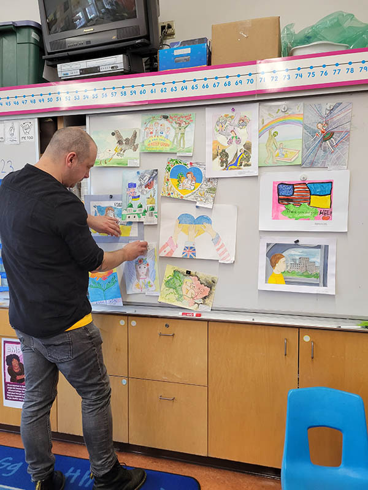
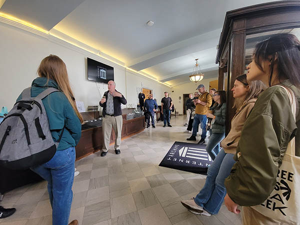
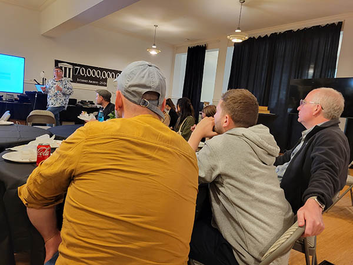

The week of May 8th was the culmination of this year's DLCL "Cultural Heritage at War" research unit, bringing the co-founders and several volunteers from Saving Ukrainian Cultural Heritage Online (SUCHO) together for several events throughout the Bay Area. Co-founders Anna Kijas and Sebastian Majstorovic attended from Boston and Berlin, respectively; long-time volunteer Andreas Segerberg came from Gothenburg; and Ulia Gosart joined the group from Los Angeles. The events were generously co-sponsored by Stanford Libraries and the Division of Literatures, Cultures, and Languages.

*(Left to right: Quinn Dombrowski, Andreas Segerberg, Anna Kijas, Sebastian Majstorovic, and Ulia Gosart at Stanford University.)*

On Monday, members of the group engaged in public humanities work by giving a presentation at Malcolm X Elementary in Berkeley, where the PTA hosted a web archiving workshop for families last year shortly after SUCHO started. The group taught the children in Jennifer Adcock's first grade class how to write their names in Ukrainian Cyrillic, and about geography and the war using Ukrainian children's drawings from an art contest at the Cherkasy Regional Library. Scans of the drawings will soon be available in the [SUCHO gallery](https://gallery.sucho.org), and will be on display in Hohbach Hall.

*Andreas Segerberg at Malcolm X Elementary school displaying children's drawings from the Cherkasy Regional Library.*

On Tuesday, the team gave a talk at CESTA, joined virtually by Erica Peaslee from College Station, TX. In this talk, "[Saving Ukrainian Cultural Heritage Online: Socially-Engaged Digital Humanities](https://cesta.stanford.edu/events/saving-ukrainian-cultural-heritage-online-socially-engaged-digital-humanities)", the group covered the work SUCHO has done to date, the importance of open culture for facilitating data rescue work, and the need for ongoing support for cultural heritage workers in Ukraine, including digitization equipment and batteries that can not only power digitization equipment and charge patrons' phones, but also ensure that security systems remain functional to prevent looting. As part of the Humanities and Area Studies special collections pop-up event in the Library with the theme of "Travel", the Textile Makerspace hosted a special DIY Ukrainian embroidery session. The day ended with a DH happy hour with DLCL grad students and CIDR staff.

*Sebastian Majstorovic presenting at CESTA and Quinn Dombrowski with children's drawings from Cherkasy*

*HannahZoe Chua-Reyes and Alyssa Virker at the embroidery pop-up, and SUCHO team and CIDR staff and DLCL grad students at the DH happy hour event*

Wednesday featured planning meetings between the SUCHO visitors and members of the DLCL who are involved in different facets of the project, including PhD student Alyssa Virker who is documenting Ukrainian poetry TikTok videos as part of her DH project. Alyssa also joined the team for organizing a workshop on website and social media archiving in Hohbach Hall. The group wrapped up their time on campus with lunch with Slavic grad students, including Georgii Korotkov who was deeply involved in scraping library catalogs using the IRBIS system, as well as Prof. Yuliya Ilchuk and visiting artist in residence Andrii Kurkov.

*SUCHO team with the opening slide for the web and social media archiving workshop*

*Ulia Gosart shows Cherkasy children's artwork to Yuliya Ilchuk and Andrii Kurkov*

On Thursday, the SUCHO visitors were joined by a large group of grad students, librarians, and DH staff for a trip to the Internet Archive (IA). Founder Brewster Kahle gave the group a personal tour of the impressive space, including the real servers with Internet Archive data in the sanctuary, several art exhibits, playable vintage video games, and 78 RPM records. After lunch, Mark Graham demonstrated some recent developments, including automated transcription, transliteration, and summarization of TV news from several countries including Ukraine, Russia, and China. This led into an open-ended discussion about how the Internet Archive can further support efforts like SUCHO, as well as other digital projects at Stanford and beyond. Enhancing the metadata for uploaded Ukrainian books came up as one priority for SUCHO. Partnering with the IA on developing or enhancing large language models for non-English languages was another promising area of mutual interest.

*Brewster Kahle gives a tour of the Internet Archive*

*A conversation with Mark Graham and visitors from Stanford and the SUCHO team*

On the final day of the trip, the team developed a list of follow-up tasks after the Internet Archive meeting, and discussed scaling the museum-oriented "Memory Savers" program -- which will put Ukrainian students into museums to assist with digitization and digital projects -- to include libraries as well. The group also discussed the possibility of aggregating metadata about the digital books in the Internet Archive's collections, and offering it as a digital data source that can be added to Ukrainian libraries' digital catalogs.

This summer, SUCHO team members will be presenting their work at the international Digital Humanities conference in Graz. Numerous projects in the DLCL connected with SUCHO will be continuing their work into next year; an application to revive the Slavic Digital Humanities research unit in order to support those projects is currently under consideration.