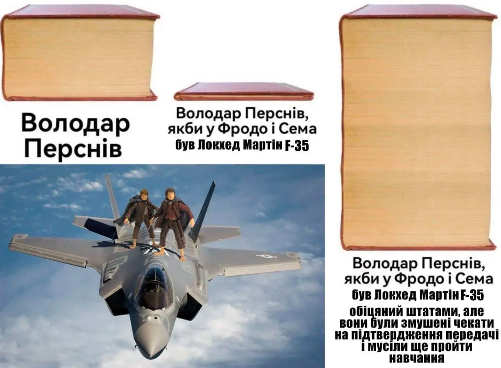

On October 12th, I presented the [SUCHO Meme Wall](https://memes.sucho.org) at the Internet Archive with Slavic department grad student Alyssa Virker, as part of the "AI at IA" event. The Meme Wall project is led by Anna Rakityanskaya, a Slavic librarian at Harvard, and the wall itself and its technical workflow were developed by my CIDR DH developer colleague Simon Wiles. On one level, it was an odd fit for an event highlighting the innovative projects happening at and around the Internet Archive that leverage AI tools, developing corpora at scale, and exploring shifts in societal attitudes towards AI. The SUCHO Meme Wall is richly annotated and entirely hand-curated by people who can read the text and interpret the context of these memes. Even the most cutting-edge tools do an uneven job at best at the same. 

As a test before the talk, I worked with Jamie Joyce from the Internet Archive to run a couple memes through Dall-e 3, asking it to explain them. It completely failed on a meme that is one of my kids' favorites. (Operation Z is a Russian name for their war; the meme came out around the time Ukraine sunk a Russian battleship.)

That meme had always struck me as one of the most straightforward ones: very easy to explain to the kids, who still giggle when they see it. When we gave Dall-e 3 what I thought of as a more complex meme, it did better:

> The image contains three segments, seemingly referencing a meme format. The text is in Ukrainian. Here's a breakdown:  
> Book Cover:  
> Top and bottom images depict a book with the title "Володар Перснів" which translates to "Lord of the Rings" in English.  
> Center Image:  
> Depicts two characters from "The Lord of the Rings" standing on a modern fighter jet (Lockheed Martin F-35).  
> Text: "Володар Перснів, якби у Фродо і Сема був Локхед Мартін F-35". This can be translated as "Lord of the Rings, if Frodo and Sam had a Lockheed Martin F-35".  
> Book Spine:  
> Text: "Володар Перснів, якби у Фродо і Сема був Локхед Мартін F-35 обіцяний штатами, але вони були змушені чекати на підтвердження передачі мусили ще пройти навчання". This translates to "Lord of the Rings, if Frodo and Sam had a Lockheed Martin F-35 promised by the states, but they had to wait for transfer confirmation and still had to undergo training".
> It's a humorous take on the idea that if the characters from "The Lord of the Rings" had modern technology, their journey and challenges would be considerably different. The joke seems to also touch upon the complexities and delays associated with military equipment transfers and training.

My takeaway from this, as with many AI experiments, is that in choosing what tasks to pass to AI challenges our human-oriented ideas of what's "easy" or "hard", and care and recalibration are essential for AI to be more use than hassle.

Alyssa spoke movingly about the power that these memes have as a vehicle for communication, self-expression, and solidarity across Ukraine and the Ukrainian diaspora. We both touched on the ways that *people love these images* and want to see them preserved. Capturing and annotating these memes-- whose existence online is ephemeral, passing swiftly into the unqueryable depths of algorithmic feeds -- is an act of resistance to Russia's attempt to extinguish Ukrainian culture. And on one level, it's deeply satisfying to know that *this* celebration of Ukrainian language, culture, and humor in dark times is (we think) the largest extensively hand-annotated meme corpus on the internet, and may well contribute to the future development of language and image models that are better at interpreting memes. In its own way, our Meme Wall is as much a hopeful and forward-looking contribution to the discussion of AI as Peter Wang's talk about AGI and ethical alignment: we're imagining a future of training data done differently, much as Lila Shroff does in her recent post "[Datasets as Imagination](https://joinreboot.org/p/artist-datasets)", which quotes Anna Ridler in [describing dataset creation as craftwork](https://annaridler.com/myriad-tulips): "repetitive, time-consuming…but necessary in order to produce something beautiful". (This very much speaks to me, as someone who runs a [Textile Makerspace](https://textilemakerspace.stanford.edu/). Thanks to Pam Lach for the pointer to that piece!)

To learn more about the SUCHO Meme Wall, check out Anna Rakityanskaya's [article in Slavic & East European Information Resources](https://doi.org/10.1080/15228886.2023.2169634). You can also check out the [video of the Internet Archive event](https://www.youtube.com/watch?v=USKMXT6t42w&ab_channel=InternetArchive) on YouTube; our portion starts around the 46 minute mark.