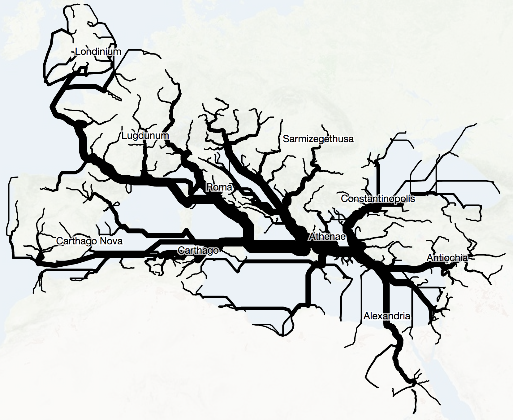
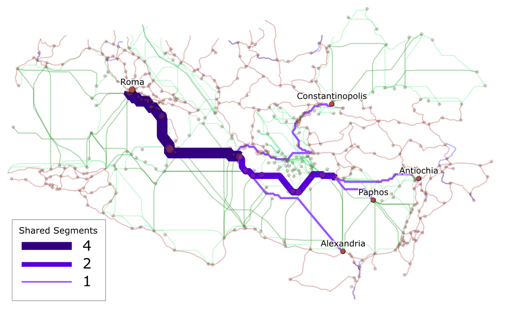
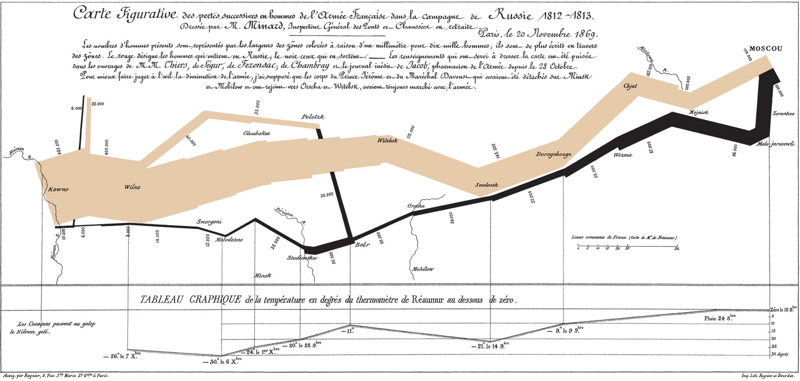
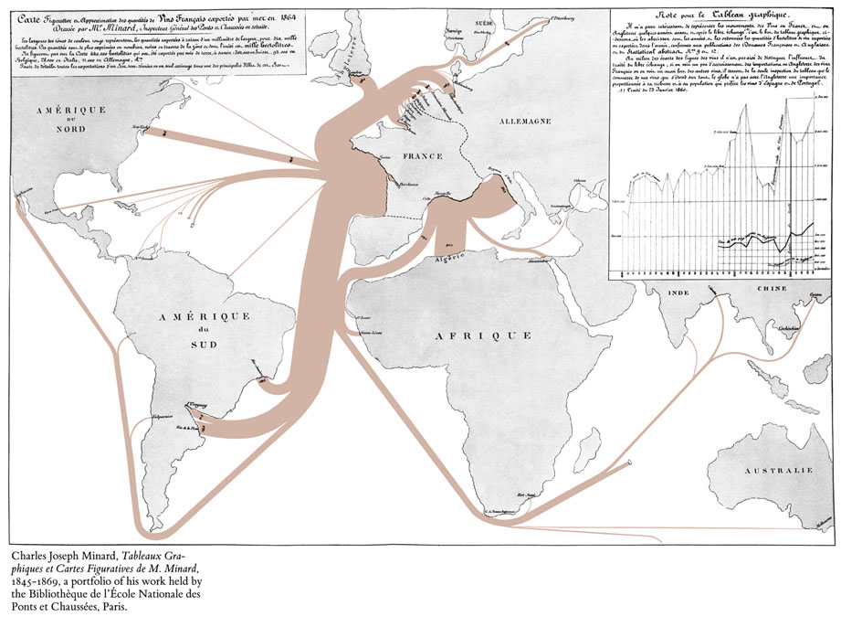
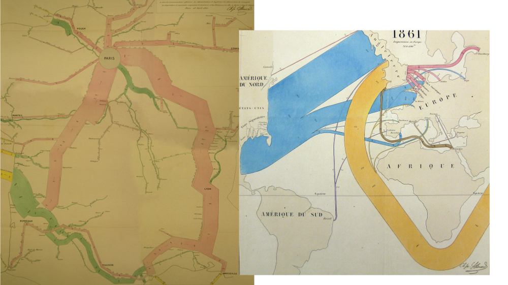

The [updated ORBIS](http://orbis.stanford.edu/v2/) is rapidly approaching completion, and with its finishing touches comes the need to describe some of the things that it does. Most of its new functionality, such as the routes or cartograms, are from the earlier version, though with much more control given to the user in their creation. But there’s a new option, which I’ve called a Minard Diagram, that produces an inky, snakey, arterial chart out of the ORBIS network. Here is a Minard Diagram for fastest routes from Athens to the rest of the Roman World.

What you’re seeing is the aggregation of paths from Athens to the rest of the sites in ORBIS based on whatever the priority and other settings were. Because ORBIS is a set of segments (known also as edges or links in network parlance) connecting sites (known as nodes), then we can see when a path from Site A to Site B shares some of the segments as a path from Site A to Site C. The thicker lines indicate more shared segments.

How it works is easier to explain if we deal with a smaller subset, say just the routes from Rome to Antioch, Constantinople, Crete, and Alexandria. Fortunately, ORBIS provides you with the ability to export SVG, which makes it easy enough to export the results of running those four routes and modify them in Inkscape to produce the following diagrams. Each segment is sized by the number of “shared segments” which is to say the pieces of the ORBIS network shared in common by the four routes. This is easier to see if we also encode shared segments with color.

This is, fundamentally, [betweenness centrality](http://en.wikipedia.org/wiki/Betweenness#Betweenness_centrality) but aggregated by edge instead of by node. Betweenness is used to discover the nodes in a network along the most frequent paths to identify power brokers or particularly influential papers in citation networks. ORBIS already calculates betweenness based on the individual routes you’ve been running, which leads to sites that are along more routes increasing in size, but calculating all the routes simultaneously from a single site to the rest of the network (in the same way that we calculate all the costs simultaneously to create a distance cartogram) provides, in the aggregate, what appears to be flow.

Whether betweenness is a proxy for flow is a question that occurred after the graphical representation of the results and not before. The creation of this diagram follows a well-trod path, repurposing existing ways of representing systems based on old successes. In this case, one of the most famous and lauded information visualization pieces is known as Minard’s Map, created by Charles Minard and focused on showing Napoleon’s march into Russia.

There are obvious visual cues that led me to referring to the ORBIS function as a Minard diagram. The most straightforward is the variable size of line thickness that implies the difficulty to get to a place, whether that difficulty is measured in **denarri** or, in the case of Minard’s map of Napoleon’s March, **human lives**.

Regardless of whether or not there’s a fundamental similarity in what Minard was representing and what is being represented in ORBIS, I think there’s a case to be made for categorizing visualization methods based on graphical appearance. Minard’s Map is a “flow map” according to the [Wikipedia entry for flow maps](http://en.wikipedia.org/wiki/Flow_map), and therefore if you’re measuring a phenomenon like betweenness, and it’s distinct from flow, then the graphical similarity is not enough to warrant naming it after Minard. But when we try to define information visualization methods based on the type of data they purport to represent, we run into another problem, illustrated with a Google image search of “flow map”:

Which ends up providing us with work that looks like Minard’s Map but also watersheds, simple networks, and org charts. I think, then, that the term Minard Diagram is more appropriate based on the visual similarity between what is being produced by this ORBIS function rather than the more generic flow map. An equivalent argument could be made for referring to this as a Watershed Diagram, given that it indicates a pooling of distant sources into streams and rivers that reach a center.

There’s a strong case to be made that visualization methods should be based on the phenomenon being visualized, rather than the graphical product. In that case, it might seem like the ORBIS Minard Diagram shouldn’t have Minard’s name, since ORBIS does not attempt to correlate temperature or casualties with routes. But Minard made a number of different information visualization pieces that involve maps and line thickness.

Minard, in these cases, is mapping strength of connection based on the aggregation of statistical data. In this case, I think ORBIS is doing the same, though instead of using statistical data, it uses a model to derive the strength of connection. The two end up with the same phenomenon--cumulative strength of ties--using different approaches, but reach the same point. Whether this means that betweenness is flow depends on how you treat information visualization. Data has no natural graphical form, and graphical forms do not come naturally from raw data. This is seen pragmatically in models of processing data to produce information visualization, which act to highlight not only attributes of data but particular relationships between data for the purpose of associating those attributes and relationships with graphical channels like color, position, size, or thickness.

If we think of a Minard Diagram as strictly constrained to the dataset used for his map of Napoleon’s March, then it is an information visualization method narrowly suited for representing flow along a path correlated with geography and some external variable (temperature in the case of the original). But if we think of Minard’s work representing a system through a series of connections from a center (whether Paris or Kaunas) which sees that strength attenuated in a heterogeneous manner that reveals geographic patterns, then suddenly the Minard Diagram is not simply another way of representing flow. Instead, it is a particular way of processing data, in this case data associated with edges, in a system where those edges are laid out in a non-arbitrary geographic manner.

The result of this and other information visualization is as much a graphical representation of the data as it is a representation of the perspective on the data and the methods used to process the data. Graphics, then, are not simply a product or publication, divorced or perhaps distilled from a dataset, but a summation of data and processing and perspective. Whether this is controversial depends on your perspective of data. If you think that information visualization is meant to only show “data”, then processing and perspective are corruptions of the pure data, and graphical similarity is a sign of someone using the “wrong” technique to represent that data. In that case, something like the Minard Diagram might be considered a dishonest attempt to hijack the cultural capital of Minard’s name for a visually similar but unrelated technique. But if the graphical similarity indicates meaningful similarities between the phenomena being represented, then it would indicate that graphical similarity of information visualization is a sign of similarity of perspective and processing in cases where the data is fundamentally different.
